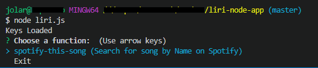
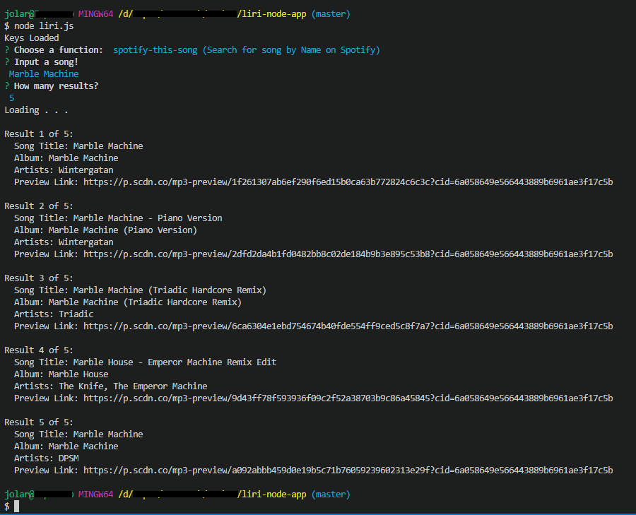

# LIRI-Bot
A language interpretation/recognition interface node.js application, used here to retrieve data for music and/or movies through the use of various API:

- For Song Data:<br>
Bands in Town API:  http://www.artists.bandsintown.com/bandsintown-api<br>
Spotify API:        https://developer.spotify.com/

- For Movie Data:<br>
Axios:      https://www.npmjs.com/package/axios<br>
OMDB API:   http://www.omdbapi.com/

- For terminal prompt input:<br>
node-inquirer:  https://github.com/SBoudrias/Inquirer.js/<br>

# Usage & Features
Select from the list of functions: (more options in the future)


In this case we look up data from Spotify by song name:


# Planned Features
- concert-this:<br>
Search the Bands in Town Artist Events API for an artist and render the following info:
  - Name of the Venue
  - Venue Location
  - Date/Time of the event (MM/DD/YYY)

- movie-this:<br>
Search a movie by name to grab various data and ratings via the OMDB API.
  - title, release year, plot, actors, language, the country the movie was produced in.
  - get ratings from IMDB and Rotten Tomatoes
  
- logging
  - write and update a log file with the user's total use history.
  - write and update a log file with the user's last search.
  - write and update a log file of the last search, named and saved by the user.

# Requirements:
- You will need a Spotify API key, and to create a .env file in which to store it in. like so:
```
# Spotify API key
SPOTIFY_ID=
SPOTIFY_SECRET=
```
- You will also need to install dependencies as needed via the terminal:
```
npm i
```
or
```
npm install
```
